# M295_LB_Projekt

## Aufgabestellung

Die Applikation soll einen von dir zu definierenden Prozess ermöglichen. Für die Daten einer relationalen Datenbank sollen CRUD-Operationen in einer REST-API zur Verfügung gestellt werden.

### Was brauche ich?

**Normale Anforderungen**
1. Arbeitsplan
2. Projektidee
3. 3 User Stories
4. Klassendiagram
5. Manuelles Testing
6. Dokumentation

 

**Technische Anforderungen**
1. Ein Github Repository für meine Projektabgabe
2. Eine Java Springboot Applikation die meine Rest API Endpunkte verwalten und mit einer Datenbank kommuniziert.
3. Eine Datenbank um meine Daten zu speichern.
4. Insomnia File mit all meinen Http requests.
5. Validierung der Daten
6. Personalisierte Exceptions  
5. Unit Tests

 

## Arbeitsplan

|Datum     |Dauer |Thema                                           |
|----------|---------------------|------------------------------------------------|
|31.10.2024|2h         | An einer Projektidee arbeiten + Github-Repository erstellen|
|02.11.2024|2h         | Projektidee festlegen, User Stories erstellen|
|03.11.2024|4h         | Grundgerüst Java Springboot und Datenbank Container erstellen|
|04.11.2024|4h         | Klassen und Controller in Java erstellen, Http Requests mit Insomnia erstellen|
|05.11.2024|4h         | Start Dokumentation
|06.11.2024|4h         | Manuelle Test + JUnit Tests
|07.11.2024|8h         | Dokumentation abschliessen

## Projektidee

Meine Anwendung soll Daten zu einer Sportliga (online oder offline) speichern und zusätzlich die Möglichkeit bieten, automatisch einen Spielplan für diese Liga zu erstellen. Eine Sportliga besteht aus mehreren Teams, und jedes Team hat eine festgelegte Anzahl von Spielern.

Nachdem alle Spieler ihren Teams zugeordnet wurden und alle Teams einer Liga angehören, kann ein vollständiger Spielplan für die ausgewählte Liga generiert werden. In diesem Plan tritt jedes Team einmal gegen jedes andere Team an. Die Matches finden jeweils in einem Stadion eines der beiden beteiligten Teams statt, und es wird automatisch ein passendes Datum für jedes Spiel festgelegt.

## User Stories

### User Story 1
**Liga**

Als Nutzer muss ich für verschiedene Zwecke eine Liga erstellen und bearbeiten können um die Übersicht zu behalten.

**Akzeptanzkriterien**

    • Der Nutzer kann alle oder genau 1 Liga anzeigen lassen.
    • Der Nutzer kann eine neue Liga erstellen
    • Der Nutzer kann den Namen und das Land der Liga anpassen
    • Der Nutzer kann eine Liga löschen
    
### User Story 2
**Team**

Als Nutzer muss ich Teams für meine Liga erstellen, bearbeiten und löschen können um mit den Daten auf dem neusten Stand zu sein.

**Akzeptanzkriterien**

    • Der Nutzer kann alle Teams anzeigen lassen.
    • Der Nutzer kann ein Spieler mit Hilfe der ID anzeigen lassen.
    • Der Nutzer kann ein neues Team erstellen.
    • Der Nutzer kann ein existierendes Team anpassen.
    • Der Nutzer kann ein existierendes Team löschen.

### User Story 3
**Spieler**

Als Nutzer muss ich Spieler für meine Teams erstellen, bearbeiten und löschen können um mit dem Austausch von neuen Spieler mithalten zu können.

**Akzeptanzkriterien**

    • Der Nutzer kann alle Spieler anzeigen lassen.
    • Der Nutzer kann ein Spieler mit Hilfe der ID anzeigen lassen.
    • Der Nutzer kann ein neuer Spieler erstellen.
    • Der Nutzer kann Werte eine Spieler anpassen.
    • Der Nutzer kann inaktive Spieler wieder löschen.
   

### User Story 4
**Spielplan Generator**

Als Nutzer möchte ich für eine Liga einen Spielplan generieren, sodass jedes Team einmal gegen jedes andere Team spielt.

**Akzeptanzkriterien**

    • Der Nutzer kann eine neuen Spielplan für eine existierende Liga erstellen.
    • Der Nutzer kann einen Spielplan mit Hilfe Der ID anzeigen lassen.

## Klassendiagram

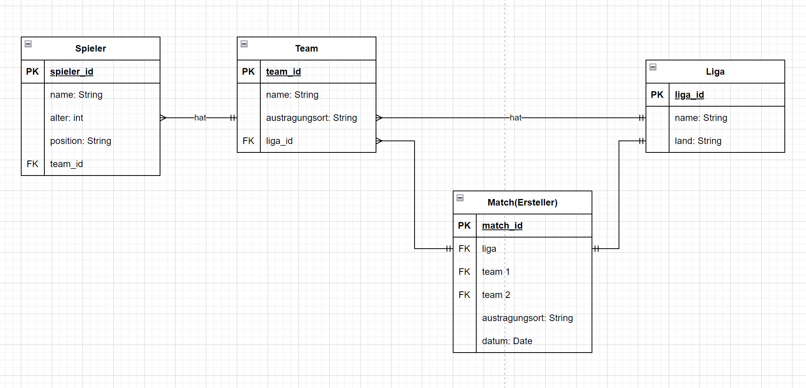

## Rest Endpunkte

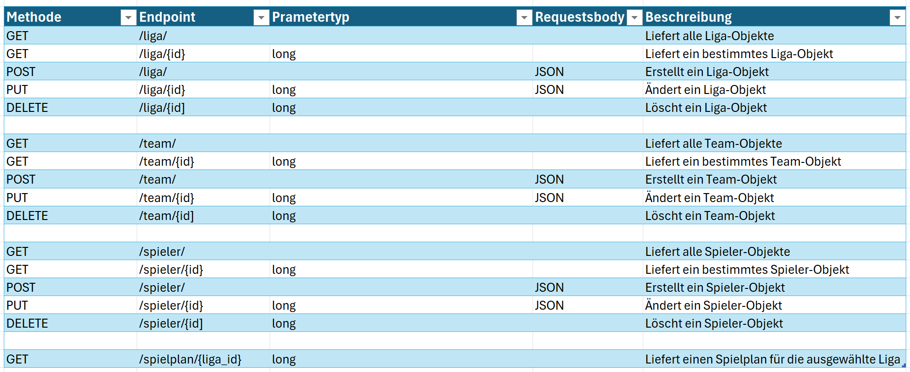

## Manuelles Testing
 
### Testkonzept
 
#### Was ist mein Ziel?
 
Ich will meine Rest API Endpunkte auf verschiedenste weise Testen.
 
1. Eine neue Liga erstellen
2. Eine neues Team neues Team erstellen
3. Ein neuer Spieler erstellen
4. Ein Spieler erstellen der 17 Jahre alt ist
5. Ein Team erstellen dessen Name mehr als 20 Character enthält
6. Ein Team erstellen das eine ungültige liga_id enthält
 
#### Wie wird getest ?
 
Es wird 1 Akzeptanztest für jeden der oben aufgelisteten Punkte durchgeführt.
 
 
#### Benötigte Infrastruktur:
- Docker 
- Einen Mysql Datenbankcontainer 
- Meine Java Springboot Applikation
- Ein Programm um Http- Requests auszuführen. Ich persönliche nutze Insomnia dafür.
- Visual Studio Code
 
 
#### Testdaten
- Testdaten für unsere Liga, Teams und Spieler
- Screenshots
- Bilder
 
 
 
 
 
|Testplan für Test 1 |                 |
|:-------------             |:--------------- |
| ID / Bezeichnung          | T-01       |
| Beschreibung              | Es wird eine neue Liga erstellt|
| Testvoraussetzung         | - Die Java Springboot Applikation muss laufen.   - Insomnia muss eingerichtet sein|
| Testschritte              | 1. Es wird ein Post request an die URL(localhost:8080/liga/) vorbereitet.   2. Es wird ein Liga-Testobjekt in den RequestBody eingefügt.   3. Der Post request wird abgesendet|
| Erwartetes Testergebnis   | Das Liga-Testobjekt wird hinzugefügt.|
 
 
 
|Testprotokoll für Test 1 |                 |
|:------------- |:--------------- |
| Tester | Jan Helbling |            |
| Testdatum | 05.11.24 |
| Ergebnis | **Der Post request mit dem Liga-Testobjekt** 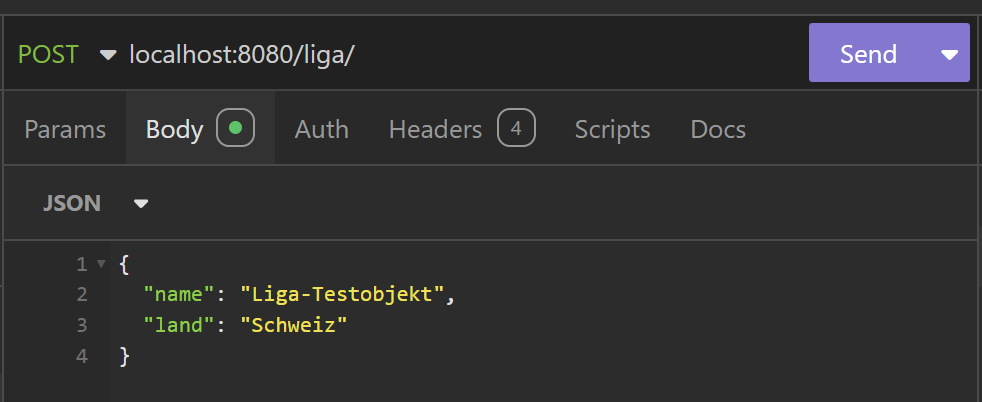      **Resultat:**   Liga wurde hinzugefügt  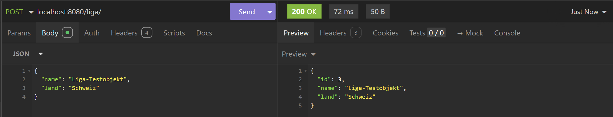   |
| Kommentar vom Tester |  Alles I.O

 

|Testplan für Test 2 |                 |
|:-------------             |:--------------- |
| ID / Bezeichnung          | T-02       |
| Beschreibung              | Es wird ein neues Team erstellt|
| Testvoraussetzung         | - Die Java Springboot Applikation muss laufen.   - Insomnia muss eingerichtet sein|
| Testschritte              | 1. Es wird ein Post request an die URL(localhost:8080/team/) vorbereitet.   2. Es wird ein Team-Testobjekt in den RequestBody eingefügt.   3. Der Post request wird abgesendet|
| Erwartetes Testergebnis   | Das Team-Testobjekt wird hinzugefügt.|
 
 
 
|Testprotokoll für Test 2 |                 |
|:------------- |:--------------- |
| Tester | Jan Helbling |            |
| Testdatum | 05.11.24 |
| Ergebnis | **Der Post request mit dem Team-Testobjekt** 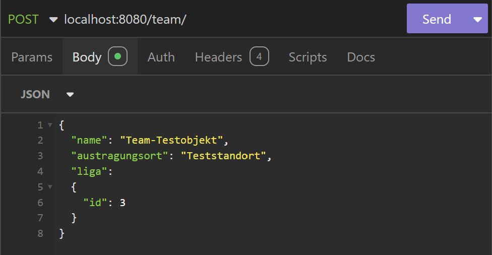 Die liga_id 3 = unsere Testobjekt liga      **Resultat:**   Team wurde hinzugefügt  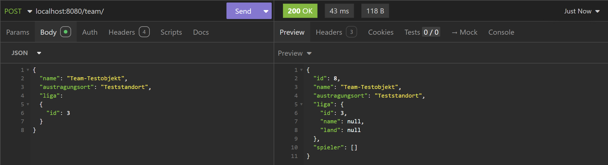   |
| Kommentar vom Tester |  Alles I.O

 

|Testplan für Test 3 |                 |
|:-------------             |:--------------- |
| ID / Bezeichnung          | T-03       |
| Beschreibung              | Es wird ein neuer Spieler erstellt|
| Testvoraussetzung         | - Die Java Springboot Applikation muss laufen.   - Insomnia muss eingerichtet sein|
| Testschritte              | 1. Es wird ein Post request an die URL(localhost:8080/spieler/) vorbereitet.   2. Es wird ein Spieler-Testobjekt in den RequestBody eingefügt.   3. Der Post request wird abgesendet|
| Erwartetes Testergebnis   | Das Spieler-Testobjekt wird hinzugefügt.|
 
 
 
|Testprotokoll für Test 3 |                 |
|:------------- |:--------------- |
| Tester | Jan Helbling |            |
| Testdatum | 05.11.24 |
| Ergebnis | **Der Post request mit dem Team-Testobjekt** 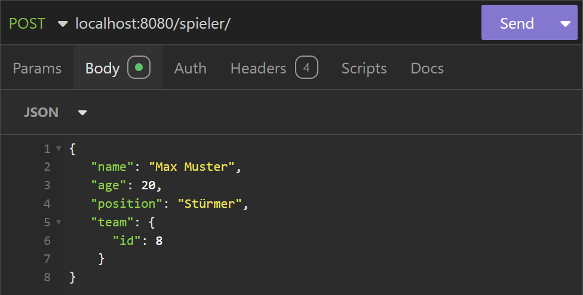 Die team_id 8 = unser Testobjekt team      **Resultat:**   Team wurde hinzugefügt  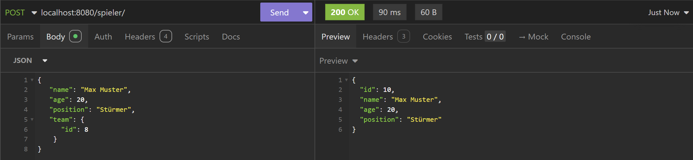   |
| Kommentar vom Tester |  Alles I.O

 

|Testplan für Test 4 |                 |
|:-------------             |:--------------- |
| ID / Bezeichnung          | T-04       |
| Beschreibung              | Es wird versucht ein Spieler zu erstellen der 17 Jahre alt ist|
| Testvoraussetzung         | - Die Java Springboot Applikation muss laufen.   - Insomnia muss eingerichtet sein|
| Testschritte              | 1. Es wird ein Post request an die URL(localhost:8080/spieler/) vorbereitet.   2. Es wird ein Spieler-Testobjekt mit dem attribut age = 17 in den RequestBody eingefügt.   3. Der Post request wird abgesendet|
| Erwartetes Testergebnis   | Der Spieler wird nicht hinzugefügt weil das Alter mindestens 18 sein muss.|
 
 
 
|Testprotokoll für Test 4 |                 |
|:------------- |:--------------- |
| Tester | Jan Helbling |            |
| Testdatum | 05.11.24 |
| Ergebnis | **Der Post request mit dem Team-Testobjekt**       **Resultat:**   400 Error, Bad Request 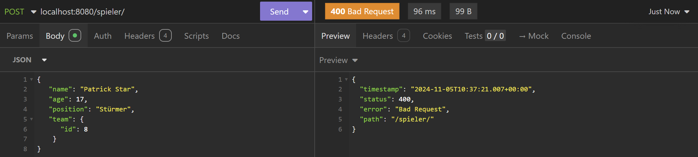   Screenshot aus dem Java Springboot Kommandozeile   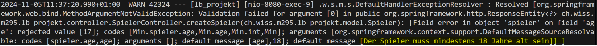|
| Kommentar vom Tester |  Alles I.O

 

|Testplan für Test 5 |                 |
|:-------------             |:--------------- |
| ID / Bezeichnung          | T-05       |
| Beschreibung              | Es wird versucht ein Team zu erstellen, das einen zu langen Namen hat(mehr als 20 Character).|
| Testvoraussetzung         | - Die Java Springboot Applikation muss laufen.   - Insomnia muss eingerichtet sein|
| Testschritte              | 1. Es wird ein Post request an die URL(localhost:8080/team/) vorbereitet.   2. Es wird ein Team-Testobjekt in den RequestBody eingefügt.   3. Der Post request wird abgesendet|
| Erwartetes Testergebnis   | Das Team wird nicht hinzugefügt weil der Name zu lang ist.|
 
 
 
|Testprotokoll für Test 5 |                 |
|:------------- |:--------------- |
| Tester | Jan Helbling |            |
| Testdatum | 05.11.24 |
| Ergebnis | **Der Post request mit dem Team-Testobjekt** 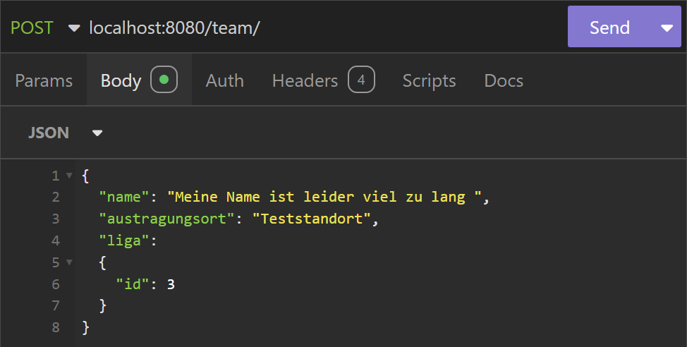      **Resultat:**   400 Error, Bad Request 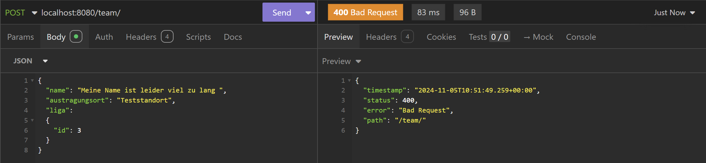   Screenshot aus dem Java Springboot Kommandozeile   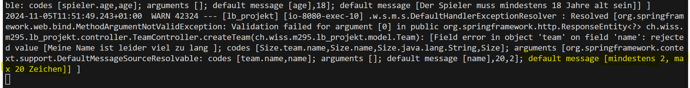|
| Kommentar vom Tester |  Alles I.O

 

|Testplan für Test 6 |                 |
|:-------------             |:--------------- |
| ID / Bezeichnung          | T-06       |
| Beschreibung              | Es wird versucht ein Team zu erstellen, dass eine ungültigen liga_id hat.|
| Testvoraussetzung         | - Die Java Springboot Applikation muss laufen.   - Insomnia muss eingerichtet sein|
| Testschritte              | 1. Es wird ein Post request an die URL(localhost:8080/team/) vorbereitet.   2. Es wird ein Team-Testobjekt in den RequestBody eingefügt.   3. Der Post request wird abgesendet|
| Erwartetes Testergebnis   | Das Team wird nicht hinzugefügt weil die liga_id ungültig ist.|
 
 
 
|Testprotokoll für Test 6 |                 |
|:------------- |:--------------- |
| Tester | Jan Helbling |            |
| Testdatum | 05.11.24 |
| Ergebnis | **Der Post request mit dem Team-Testobjekt** 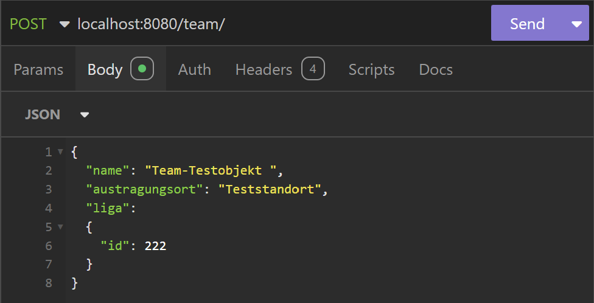      **Resultat:**   500 Error, Internal Server Error 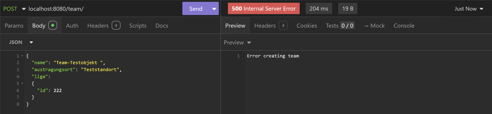|
| Kommentar vom Tester |  Alles I.O

## Arbeits journal
|Datum     |Dauer |Thema                                           |
|----------|---------------------|------------------------------------------------|
|31.10.2024|2h         | An einer Projektidee arbeiten + Github-Repository erstellen|
|02.11.2024|2h         | Projektidee festlegen, User Stories erstellen|
|02.11.2024|2h         | Klassendiagramm erstellen, Rest Schnittstellen dokumentieren|
|03.11.2024|2h         | Grundgerüst Java Springboot und Datenbank Container erstellen|
|03.11.2024|2h         | Klassen und Controller in Java erstellen|
|04.11.2024|4h         | Klassen und Controller in Java erstellen, Http Requests mit Insomnia erstellen|
|05.11.2024|2h         | Start Dokumentation
